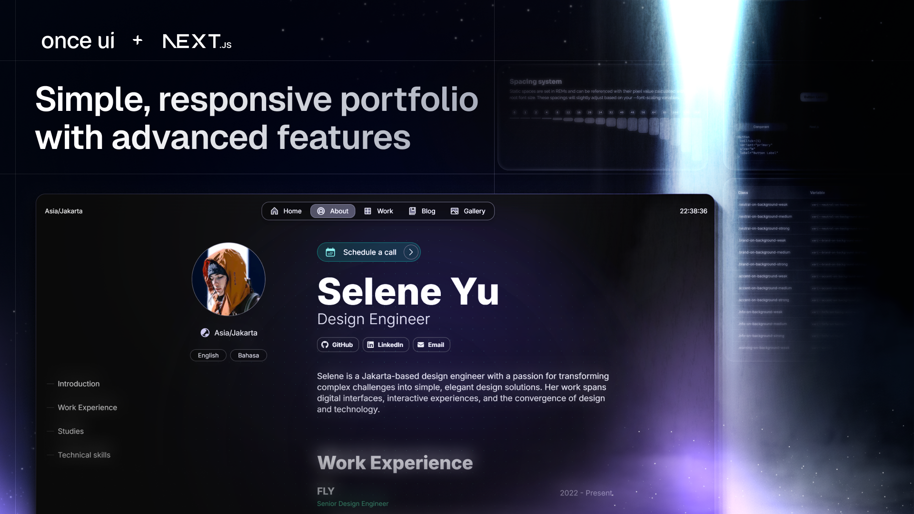

# **Build your portfolio with Once UI's Magic Portfolio**

View the [demo here](https://demo.magic-portfolio.com).

# **Getting started**

Magic Portfolio was built with [Once UI](https://once-ui.com) for [Next.js](https://nextjs.org). It requires Node.js v18.17+.

# **Authors**

Connect with us on Threads or LinkedIn.

Lorant Toth: [Threads](https://www.threads.net/@lorant.one), [LinkedIn](https://www.linkedin.com/in/tothlorant/)  
Zsofia Komaromi: [Threads](https://www.threads.net/@zsofia_kom), [LinkedIn](https://www.linkedin.com/in/zsofiakomaromi/)

Localization added by [François Hernandez](https://github.com/francoishernandez)

# **Get involved**

- Join the [Design Engineers Club on Discord](https://discord.com/invite/5EyAQ4eNdS) and share your portfolio with us!
- Report a [bug](https://github.com/once-ui-system/magic-portfolio/issues/new?labels=bug&template=bug_report.md).

# **License**

Distributed under the CC BY-NC 4.0 License.

- Commercial usage is not allowed.
- Attribution is required.

See `LICENSE.txt` for more information.
