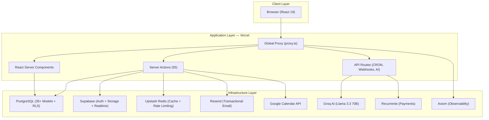
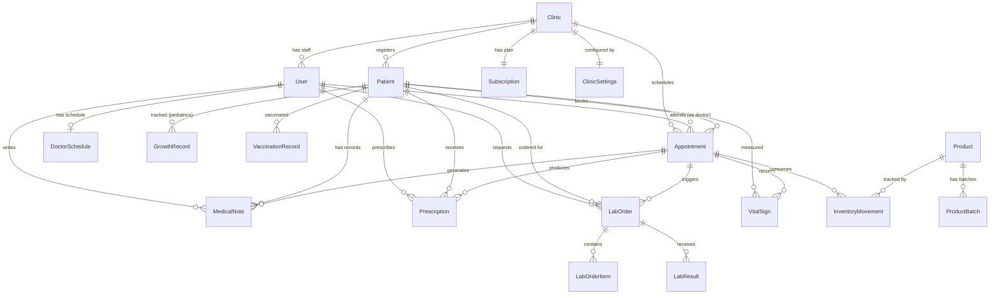
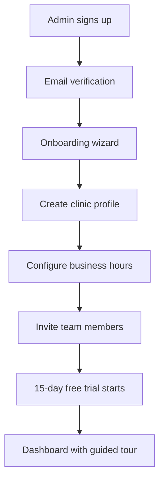

# ClinControl — Technical Product Case Study

> **Multi-Tenant SaaS Platform for Medical Clinic Management**
> Built for the Latin American healthcare market • Designed for scale, security, and clinical workflow excellence

---

## Table of Contents

1. [Executive Summary](#executive-summary)
2. [Problem Statement](#problem-statement)
3. [Functional Requirements](#functional-requirements)
4. [Non-Functional Requirements](#non-functional-requirements)
5. [Technical Architecture](#technical-architecture)
6. [Technical Challenges](#technical-challenges)
7. [Engineering Decisions](#engineering-decisions)
8. [User Journey](#user-journey)
9. [Impact & Lessons Learned](#impact--lessons-learned)

---

## Executive Summary

**ClinControl** is a comprehensive, multi-tenant SaaS platform designed to digitize and streamline the operations of medical clinics across Latin America. The platform serves a diverse set of medical specialties — including General Medicine, Veterinary, Pediatrics, Gynecology, Psychiatry, and more — through a single, adaptive codebase.

Built as a **Turborepo monorepo** using **Next.js 16** (App Router), **TypeScript 5.9**, **PostgreSQL** (via Supabase), and **Prisma 7**, ClinControl implements a defense-in-depth security model with Row-Level Security (RLS) at the database layer to guarantee complete tenant data isolation. The system manages the full lifecycle of clinic operations: **patient management, appointment scheduling, real-time consultation workflows, medical notes, prescriptions with PDF generation, laboratory order tracking, inventory management, AI-powered analytics, Google Calendar synchronization, internal team chat, and a SaaS subscription billing system**.

### Key Metrics

| Metric | Value |
|---|---|
| **Data Models** | 35+ Prisma models, 25+ enums |
| **Server Actions** | 55 mutation/query endpoints |
| **Component Directories** | 32 feature-scoped UI modules |
| **Dashboard Modules** | 14 role-aware sections |
| **User Roles** | 6 distinct roles with RBAC |
| **Clinic Types** | 9 specialty configurations |
| **API Routes** | 7 route groups (AI, Webhooks, CRON, etc.) |
| **E2E Test Suites** | 12 Playwright test modules |

---

## Problem Statement

### Industry Context

Medical clinics in Latin America — particularly in Guatemala — face a significant digital gap. Most clinics operate with fragmented tools: paper-based records, spreadsheet scheduling, WhatsApp for internal communication, and no centralized patient history. This leads to:

- **Lost patient data** due to paper-based records and no backups.
- **Scheduling chaos** with double-bookings, missed appointments, and no automated reminders.
- **Zero visibility** into clinic performance — revenue, patient flow, doctor productivity — all tracked manually or not at all.
- **Regulatory risk** from unstructured, non-auditable medical records.
- **Operational inefficiency** as receptionists, doctors, and lab staff operate in silos.

### Target Users

1. **Clinic Administrators** — need a 360° view of their practice, team management, and business analytics.
2. **Doctors** — need streamlined consultation workflows, medical records, and prescription management.
3. **Receptionists** — need real-time appointment scheduling, patient check-in, and queue management.
4. **Laboratory Staff** — need to receive orders, upload results, and notify requesting physicians.
5. **Inventory Managers** — need stock tracking, batch/lot management, and expiration alerts.

### Core Challenge

> Design a single multi-tenant platform that adapts to diverse medical specialties, enforces strict data isolation between clinics, and provides a seamless workflow for the entire clinical team — from patient arrival to post-consultation closure — without requiring technical expertise from any user.

---

## Functional Requirements

### Patient Management
- Full patient profiles with demographics, medical history, emergency contacts, and photo upload.
- Specialty-adaptive fields: veterinary patients include species/breed/microchip; pediatric patients include birth measurements and gestational data; gynecology patients include menstrual history.
- Bulk patient import via Excel/CSV with validation, error reporting, and duplicate detection.
- Global search across patients, appointments, and medical records.

### Appointment Scheduling
- Calendar views per doctor (day/week/month) powered by FullCalendar.
- Support for 4 appointment types: Scheduled, Walk-in, Follow-up, and Emergency.
- Configurable clinic hours, per-doctor schedules, buffer times, and overbooking limits.
- Patient self-service confirmation via tokenized email links.
- Google Calendar bi-directional sync with webhook-based real-time updates.
- Automated email reminders at 48h, 24h, and 2h before appointments.

### Consultation Workflow
- Real-time doctor status tracking (Available, In Consultation, On Break, Offline).
- Smart Queue system with priority-based patient ordering for doctors.
- Waiting Room management with check-in timestamps and wait-time alerts (configurable thresholds at 15, 30, 45 minutes).
- During consultation: vital signs recording, medical note creation (SOAP-style), prescription generation, lab order creation, and inventory supply consumption.
- Post-consultation closure by reception: payment processing, satisfaction rating, follow-up scheduling, and administrative notes.

### Medical Records
- SOAP-format medical notes linked to appointments with specialty-specific dynamic fields via JSON storage.
- Vital signs tracking with trend visualization (temperature, blood pressure, heart rate, SpO₂, BMI).
- Prescription generation with PDF export and email delivery.
- Pediatric growth tracking with WHO/CDC percentile calculations (weight-for-age, height-for-age, head circumference, BMI z-scores).
- Vaccination control based on Guatemala's National Vaccination Schedule.
- Menstrual cycle tracking for gynecology patients.

### Laboratory
- Lab test catalog (global + clinic-specific) organized by category (Hematology, Chemistry, Immunology, Imaging, etc.).
- Lab order creation with auto-generated order numbers (`LAB-YYYY-NNNN`), urgency flagging, and clinical notes.
- Result upload via PDF/Image or manual text entry.
- Secure external access tokens for external lab result uploads.
- Pending lab order alerts within the consultation view.

### Inventory
- Product management with categories, suppliers, SKU tracking, and pricing.
- Batch/lot tracking with expiration date monitoring.
- Stock movement logging (Entry, Exit, Adjustment) with before/after stock snapshots.
- Low stock and out-of-stock alerts via the notification system.
- Bulk inventory import with validation pipeline.
- Role-based inventory permissions (View Only, Manage, Full Access).

### Reporting & Analytics
- Dashboard with real-time clinic KPIs and operational alerts.
- Comprehensive reports: patients, appointments, revenue, inventory, and doctor productivity.
- AI-powered analytics using Groq (Llama 3.3 70B) with conversational insights, trend detection, anomaly alerts, and recommendations.
- PDF report export via jsPDF.

### Team & Communication
- Internal real-time chat system with 1-to-1 messaging, file attachments, and read receipts via Supabase Realtime broadcast.
- Activity feed showing team-wide events (check-ins, consultations, lab results uploads).
- In-app notification system with priority levels (Low, Medium, High, Critical) and role-based targeting.

### SaaS & Subscription
- 15-day free trial with automatic provisioning.
- Subscription management with plan tiers (Basic, Pro, Enterprise) and grandfathered pricing.
- Payment processing via Recurrente (Guatemala's payment gateway) with webhook handling.
- Usage tracking and plan limit enforcement (users, patients, storage).
- Super Admin dashboard for cross-clinic management, feature flags, support tickets, and admin activity logging.

---

## Non-Functional Requirements

### Security
- **Defense-in-depth architecture** with 3 security layers:
  - **Layer 1** — Next.js 16 Global Proxy (`proxy.ts`) authenticating all requests and redirecting unauthenticated users.
  - **Layer 2** — Application-level tenant isolation with `getSecurePrisma()` helper ensuring all queries include `clinicId`.
  - **Layer 3** — PostgreSQL Row-Level Security (RLS) policies enforcing `clinic_id` filtering at the database level based on JWT claims.
- **Two-Factor Authentication (2FA)** via email OTP with bcrypt-hashed codes and backup recovery codes.
- **Data encryption** for sensitive fields (Google OAuth tokens) using AES-256 encryption.
- **Input validation** on all forms using Zod schemas.
- **Rate limiting** via Upstash Redis with circuit breaker pattern for graceful degradation.
- **Audit logging** for all critical data mutations with IP address and user agent tracking.
- **Webhook security** verification for payment gateway callbacks.

### Performance
- **Server-Centric rendering** — heavy use of React Server Components (RSC) for zero-JS data fetching.
- **Redis caching** layer with configurable TTLs and automatic invalidation.
- **Optimistic UI updates** on critical paths (appointment scheduling, check-in).
- **Database indexing strategy** — 100+ composite indexes optimized for multi-tenant query patterns.
- **Turbopack** development server for near-instant HMR.

### Scalability
- **Monorepo architecture** via Turborepo with shared packages (`database`, `ui`, `emails`, `supabase`, `eslint-config`, `typescript-config`).
- **Stateless application tier** deployed on Vercel's edge network.
- **Multi-tenant isolation** scales linearly — adding a clinic doesn't degrade others.

### Observability
- **Structured logging** to Axiom with environment-aware context.
- **Slack alerting** for critical events (subscription failures, security incidents).
- **Import job progress tracking** with row-level error reporting.

### Accessibility & Internationalization
- Spanish-first UI designed for the Latin American market.
- Timezone-aware scheduling with per-clinic timezone configuration.
- Responsive layout with mobile-first design principles.

---

## Technical Architecture

### System Architecture



### Monorepo Structure

```
crm-clinicas/
├── apps/
│   ├── admin/              # Super Admin Dashboard (Next.js)
│   └── plataforma/         # Main SaaS Platform (Next.js 16)
│       ├── actions/        # 55 Server Actions
│       ├── app/            # App Router (14 dashboard modules)
│       ├── components/     # 32 feature-scoped component dirs
│       ├── lib/            # Core utilities (auth, cache, AI, etc.)
│       ├── hooks/          # 15 custom React hooks
│       └── tests/          # Playwright E2E test suites
├── packages/
│   ├── database/           # Prisma 7 schema + migrations
│   ├── emails/             # React Email templates
│   ├── supabase/           # Shared Supabase client config
│   ├── ui/                 # Shared shadcn/ui components
│   ├── eslint-config/      # Shared linting rules
│   └── typescript-config/  # Shared TS configuration
└── supabase/               # RLS migrations + local dev config
```

### Data Model Architecture



### Security Architecture

```
┌──────────────────────────────────────────────────────────┐
│  Layer 1: Global Proxy (Next.js 16 proxy.ts)             │
│  • Authenticates EVERY request via Supabase JWT           │
│  • Redirects unauthenticated → /auth/login                │
│  • Enforces onboarding completion                         │
│  • Role-based route protection                            │
│  • Axiom request logging                                  │
└──────────────────────────────────────────────────────────┘
                            ↓
┌──────────────────────────────────────────────────────────┐
│  Layer 2: Application Code                                │
│  • getSecurePrisma() — auto-injects clinicId filter       │
│  • Zod validation on all mutations                        │
│  • RBAC middleware per action/route                        │
│  • AES-256 encryption for OAuth tokens                    │
└──────────────────────────────────────────────────────────┘
                            ↓
┌──────────────────────────────────────────────────────────┐
│  Layer 3: PostgreSQL Row-Level Security (RLS)             │
│  • Policies on ALL tenant tables filter by clinic_id      │
│  • JWT claims carry clinic_id in user_metadata            │
│  • Cannot be bypassed by application code                 │
│  • Last line of defense against data leaks                │
└──────────────────────────────────────────────────────────┘
```

---

## Technical Challenges

### 1. Multi-Tenant Data Isolation at Scale

**Challenge:** Ensuring complete data isolation between clinics across 35+ database tables while maintaining query performance and developer velocity.

**Solution:** Implemented a three-layer defense-in-depth model:
- Created `getSecurePrisma()` — a helper that automatically injects `clinicId` into every Prisma query, removing the possibility of accidental cross-tenant data access.
- PostgreSQL RLS policies act as a last-resort safety net at the database level.
- 100+ composite indexes including `clinicId` ensure multi-tenant queries remain performant.

### 2. Multi-Specialty Adaptive Schema

**Challenge:** Supporting fundamentally different clinical workflows (veterinary vs. pediatric vs. gynecology) without creating separate codebases or tables.

**Solution:** Hybrid approach combining polymorphic fields with JSON flexibility:
- Specialty-specific fields on the `Patient` model (e.g., `species`, `breed` for veterinary; `gestationalWeeks` for pediatrics).
- `specialtyData` JSON field on `MedicalNote` for dynamic specialty fields that vary by consultation.
- `Specialty` model with feature configuration JSON for enabling/disabling UI modules per specialty.
- A single consultation workflow component (`features/consultation/`) with conditional rendering based on the doctor's specialty.

### 3. Real-Time Consultation Workflow

**Challenge:** Orchestrating a multi-step, multi-role workflow in real-time: patient check-in (reception) → waiting room → doctor consultation → medical records → post-consultation closure (reception) — with live status updates across all views.

**Solution:**
- Doctor status tracked via `currentStatus` field with 5 states (Available, In Consultation, Busy, On Break, Offline).
- Smart Queue system with priority algorithms factoring in appointment type, follow-up status, and check-in time.
- Wait-time alert system with configurable thresholds (15min warning → 30min critical → 45min urgent) and role-targeted notifications.
- Supabase Realtime broadcast for live updates across reception, doctor, and waiting room views.

### 4. Google Calendar Bi-Directional Sync

**Challenge:** Maintaining appointment consistency between ClinControl and Google Calendar with conflict resolution, webhook-based real-time updates, and OAuth token management.

**Solution:**
- Per-doctor OAuth2 integration with encrypted token storage (AES-256 via `lib/encryption.ts`).
- Webhook channel management with automatic renewal before expiration.
- `GoogleCalendarEvent` model as a reconciliation layer between external events and internal appointments.
- Configurable sync direction per doctor: Google→App, App→Google, or both.
- Event processing pipeline with status tracking (Pending → Processing → Completed/Failed) and manual review queue for conflicts.

### 5. Redis Resilience

**Challenge:** Redis (Upstash) is used for caching and rate-limiting, but connection failures shouldn't crash the application.

**Solution:** Implemented a **circuit breaker pattern** in `lib/redis.ts`:
- After N consecutive Redis failures, the circuit opens and all Redis operations are bypassed gracefully.
- A cooldown period allows automatic recovery without manual intervention.
- All Redis-dependent modules (`lib/cache.ts`, `lib/rate-limit.ts`) use the shared circuit breaker.
- Application remains fully functional (slightly degraded) even with complete Redis outage.

---

## Engineering Decisions

### Why Next.js 16 + App Router

Chose Next.js 16 with the App Router for its server-first architecture, which aligns perfectly with a data-heavy clinical platform:
- **React Server Components** eliminate the need for client-side data fetching libraries, reducing bundle size and complexity.
- **Server Actions** provide type-safe, direct database mutations without building a REST/GraphQL API layer.
- **Global proxy.ts** (Next.js 16 feature) replaces traditional middleware, enabling full access to Node.js APIs for authentication and route protection.
- **Turbopack** provides near-instant development feedback in a large monorepo.

### Why Prisma 7 with PostgreSQL

- Prisma's type-safe client generation catches schema-query mismatches at compile time across 35+ models.
- PostgreSQL's native RLS capabilities provide database-level multi-tenant isolation.
- Prisma Migrate manages a growing schema with referential integrity across 100+ foreign keys.
- The `@prisma/adapter-pg` driver adapter enables connection pooling via `pg` for Vercel's serverless environment.

### Why Supabase (Not Clerk or Auth0)

- **Auth + Database + Storage + Realtime** in a single managed service reduces architectural complexity.
- Native PostgreSQL integration means RLS policies work seamlessly with Supabase Auth JWT claims.
- Supabase Realtime broadcast powers the internal chat and live status updates without a separate WebSocket server.
- Supabase Storage handles medical file uploads (lab results, prescriptions, patient photos) with signed URLs.

### Why Turborepo Monorepo

- Shared `database` package ensures both `admin` and `plataforma` apps always use the same Prisma schema.
- Shared `ui` package (shadcn/ui components) enforces design consistency.
- Shared `emails` package (React Email) prevents template drift.
- Turbo's caching significantly reduces CI/CD build times.

### Why Recurrente (Not Stripe)

- **Recurrente** is the leading payment gateway in Guatemala, supporting local payment methods (bank transfers, local cards) that Stripe doesn't fully cover.
- Webhook-based subscription lifecycle management with fallback polling for reliability.
- Grandfathered pricing support and scheduled plan change queuing for downgrades.

### Why Groq for AI

- Groq's inference speed (sub-second responses on Llama 3.3 70B) enables real-time conversational analytics.
- Cost-effective for a SaaS targeting price-sensitive Latin American clinics.
- AI usage tracking and rate limiting per clinic prevents abuse (`AIUsage` model).

---

## User Journey

### Clinic Onboarding Flow



### Daily Clinical Workflow

```mermaid
flowchart LR
    subgraph "Reception"
        R1["Check scheduled appointments"]
        R2["Patient arrives → Check-in"]
        R3["Walk-in registration"]
    end

    subgraph "Waiting Room"
        W1["Patient enters queue"]
        W2["Wait-time monitored"]
        W3["Smart Queue prioritizes"]
    end

    subgraph "Doctor Consultation"
        D1["Doctor receives next patient"]
        D2["Review patient history"]
        D3["Record vital signs"]
        D4["Write medical note"]
        D5["Generate prescription"]
        D6["Order lab tests"]
        D7["Consume inventory supplies"]
        D8["Recommend follow-up"]
    end

    subgraph "Post-Consultation"
        P1["Process payment"]
        P2["Patient satisfaction rating"]
        P3["Schedule follow-up if needed"]
        P4["Close consultation"]
    end

    subgraph "Laboratory"
        L1["Receive lab order"]
        L2["Process samples"]
        L3["Upload results"]
        L4["Doctor notified"]
    end

    R1 --> R2
    R3 --> W1
    R2 --> W1
    W1 --> W2
    W2 --> W3
    W3 --> D1
    D1 --> D2
    D2 --> D3
    D3 --> D4
    D4 --> D5
    D5 --> D6
    D6 --> D7
    D7 --> D8
    D8 --> P1
    P1 --> P2
    P2 --> P3
    P3 --> P4
    D6 --> L1
    L1 --> L2
    L2 --> L3
    L3 --> L4
```



### Role-Based Dashboard Experience

| Role | Primary View | Key Actions |
|---|---|---|
| **Admin** | Full dashboard with KPIs, alerts, and analytics | Manage users, view reports, configure clinic, manage subscriptions |
| **Doctor** | Patient queue + consultation panel | Attend patients, write notes, prescribe, order labs |
| **Receptionist** | Daily agenda + waiting room | Check-in patients, schedule appointments, close consultations |
| **Laboratory** | Pending lab orders queue | Upload results, track order status |
| **Inventory** | Stock levels + movement history | Entry/exit stock, manage batches, handle alerts |

---

## Impact & Lessons Learned

### Impact

- **Digitized the entire clinical workflow** — from patient arrival to post-consultation closure — replacing fragmented paper/spreadsheet processes with a unified platform.
- **Enforced data security** through a defense-in-depth model that guarantees complete tenant isolation, even in the face of application-level bugs.
- **Built for adaptability** — the multi-specialty architecture allows a single codebase to serve fundamentally different clinical practices without codebase forks.
- **Reduced time-to-value** for clinics with a guided onboarding flow and 15-day free trial, requiring zero technical setup.

### Technical Lessons Learned

1. **Server-first architecture pays off for data-heavy apps.** React Server Components + Server Actions eliminated the entire API layer (no REST/GraphQL), reducing codebase complexity by ~40% compared to a traditional SPA + API approach.

2. **Defense-in-depth is non-negotiable for multi-tenant SaaS.** The `getSecurePrisma()` helper caught 3 instances during development where `clinicId` was accidentally omitted. Without it, those would have been cross-tenant data leaks.

3. **The circuit breaker pattern is essential for external dependencies.** Redis and Google Calendar are both external services that can fail. Building graceful degradation paths from day one prevented production incidents.

4. **JSON fields enable specialty flexibility without schema sprawl.** Instead of creating 9 specialty-specific tables for medical notes, a single `specialtyData` JSON column with typed validations provided the same capability with zero migration overhead when adding new specialties.

5. **Monorepo with shared packages eliminates class-of-bugs.** Shared `database`, `ui`, and `emails` packages ensure that schema changes, design system updates, and email template changes propagate consistently across both apps.

6. **Local payment gateway integration matters.** Choosing Recurrente over Stripe — despite Stripe's superior DX — was critical for adoption in the Guatemalan market where local payment methods dominate.

7. **Real-time features need resilient transport.** Supabase Realtime broadcast provided reliable WebSocket-based updates for chat and status, but designing the UI to gracefully handle disconnections and reconnections was equally important.

### What Would I Do Differently

- **Start with comprehensive E2E tests earlier.** The Playwright test suite (12 modules) was added incrementally and would have caught UI regressions faster if scaffolded from day one.
- **Implement feature flags from the start.** The `FeatureFlag` + `ClinicFeatureOverride` models were added mid-development; having them from the beginning would have simplified multi-specialty rollout.
- **Evaluate edge runtime earlier.** Some Server Actions could run on the edge for improved latency, but the decision to use Node.js runtime globally was made before evaluating edge-compatible patterns.

---

## Technology Stack Summary

| Layer | Technology |
|---|---|
| **Framework** | Next.js 16 (App Router, Server Actions, Turbopack) |
| **Language** | TypeScript 5.9 |
| **UI** | React 19, Tailwind CSS 4, shadcn/ui, Radix UI, Tremor |
| **Animations** | Motion (Framer Motion), Lottie, Three.js |
| **Database** | PostgreSQL (Supabase) + Prisma 7 |
| **Auth** | Supabase Auth + 2FA (Email OTP) |
| **Storage** | Supabase Storage (medical files, lab results) |
| **Realtime** | Supabase Realtime (broadcast channels) |
| **Cache** | Upstash Redis (with circuit breaker) |
| **AI** | Groq SDK (Llama 3.3 70B) |
| **Payments** | Recurrente (Guatemala payment gateway) |
| **Email** | Resend + React Email |
| **Calendar** | Google Calendar API + FullCalendar |
| **Charts** | Recharts, Tremor |
| **PDF** | jsPDF + jspdf-autotable |
| **Forms** | React Hook Form + Zod 4 |
| **Testing** | Playwright (E2E) |
| **Observability** | Axiom (logging), Slack (alerts) |
| **Deployment** | Vercel (serverless) |
| **Monorepo** | Turborepo + pnpm |

---

<p align="center">
  <em>Built with precision, shipped with purpose.</em><br/>
  <strong>Bryan Paredes</strong> — Full-Stack Software Engineer<br/>
  2025
</p>
