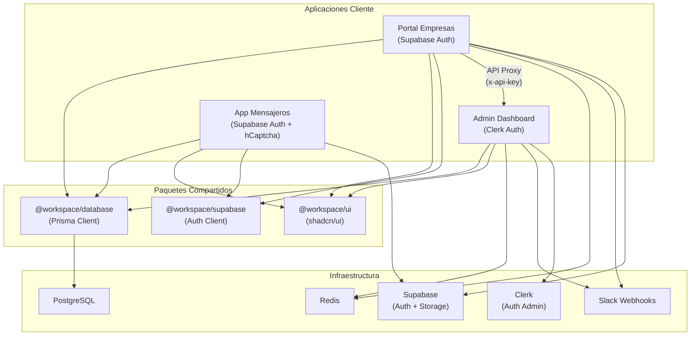
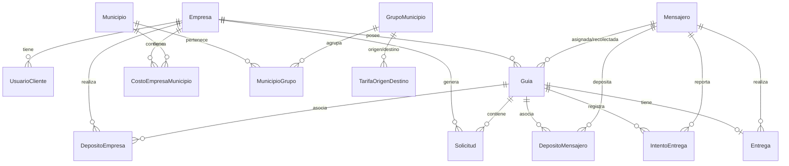
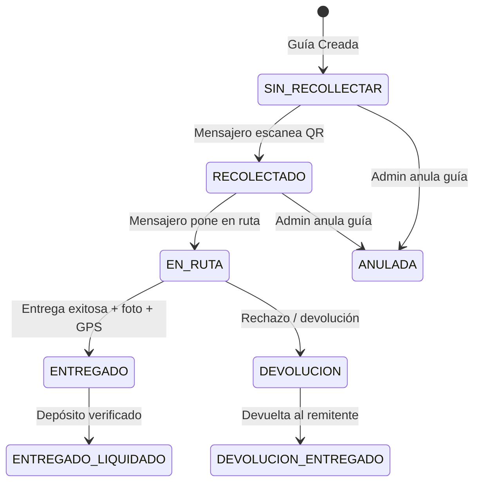
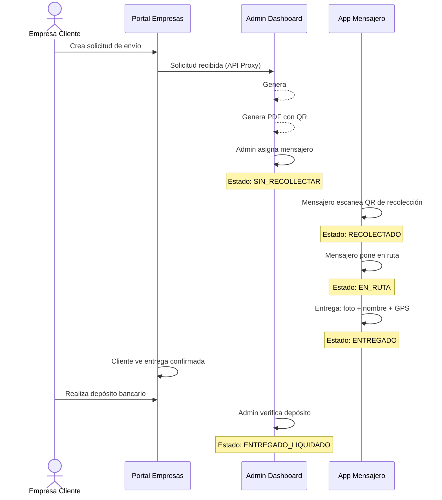
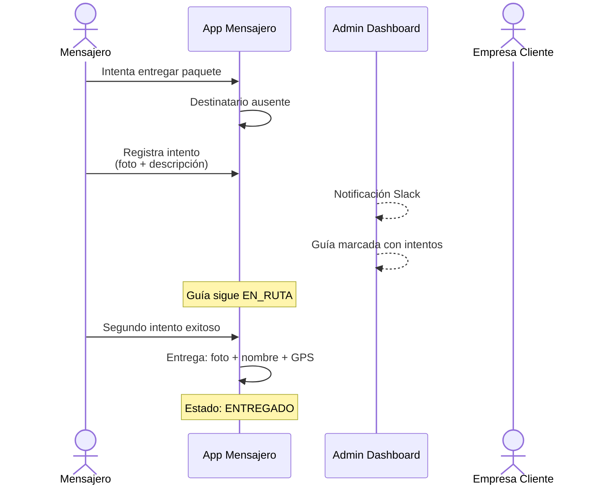
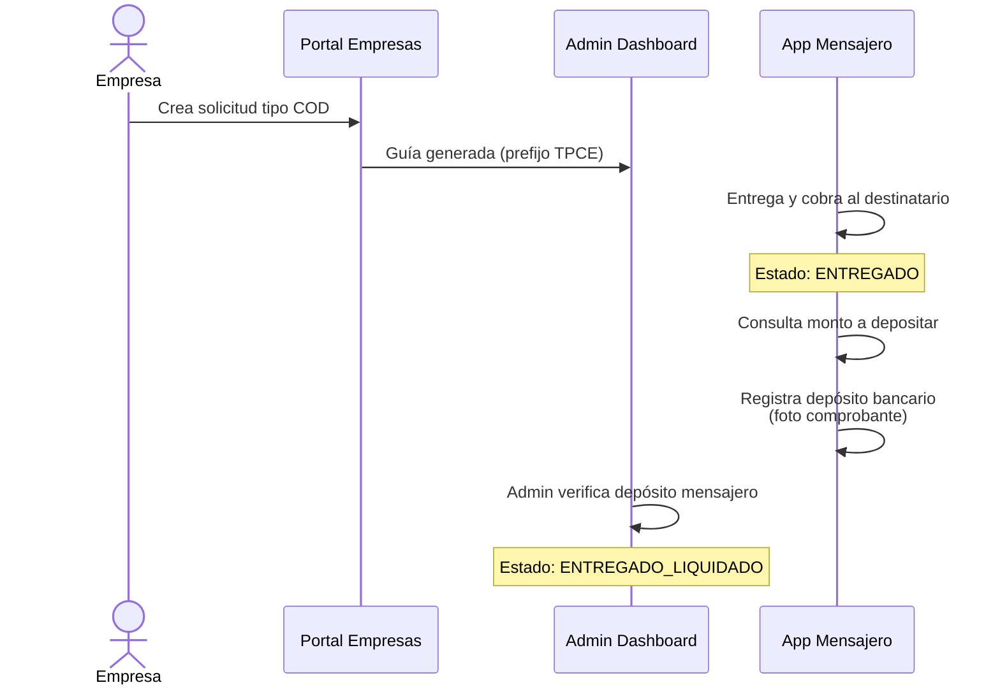

# TPC Express — Technical Product Case Study

> **Sistema integral de gestión logística para empresa de mensajería**
> Next.js 16 · React 19 · PostgreSQL · Prisma · Redis · Supabase · Clerk · Leaflet · Turborepo

---

## 1. Executive Summary

**TPC Express** es una plataforma de gestión logística de punta a punta diseñada para una empresa de mensajería en Guatemala. El sistema digitaliza el ciclo de vida completo de una orden de envío — desde la solicitud del cliente empresarial hasta la entrega final con evidencia fotográfica y coordenadas GPS — eliminando procesos manuales y brindando visibilidad en tiempo real a todos los actores involucrados.

La solución se implementó como un **monorepo con tres aplicaciones independientes** y cinco paquetes compartidos, cada una orientada a un perfil de usuario distinto:

| Aplicación | Usuario objetivo | Propósito |
|---|---|---|
| **Admin** | Operadores TPC | Centro de control para gestión total del negocio |
| **Empresas** | Clientes corporativos | Portal de autoservicio para creación y seguimiento de envíos |
| **Mensajeros** | Mensajeros en campo | App optimizada para móvil con escaneo QR, entregas y recolecciones |

El resultado es un ecosistema conectado que reduce tiempos operativos, elimina errores de registro manual y genera trazabilidad completa de cada paquete a lo largo de **8 estados de guía** posibles.

---

## 2. Problem Statement

### Contexto

La empresa de mensajería TPC Express operaba con procesos predominantemente manuales:

- **Órdenes en papel o WhatsApp:** Las empresas clientes enviaban solicitudes de envío por mensajería o llamada telefónica, generando errores de transcripción y pérdida de información.
- **Asignación opaca:** La asignación de guías a mensajeros se realizaba verbalmente, sin trazabilidad ni confirmación digital.
- **Sin evidencia de entrega:** No existía un mecanismo estandarizado para registrar prueba de entrega (foto, firma, GPS).
- **Liquidación manual:** El cálculo de montos COD (Cash on Delivery), depósitos de empresas y liquidaciones de mensajeros se hacía en hojas de cálculo, propenso a errores y fraude.
- **Nula visibilidad:** Los clientes corporativos no tenían forma de conocer el estado de sus envíos en tiempo real.

### Desafíos clave a resolver

1. Digitalizar el ciclo completo de una orden: solicitud → guía → recolección → ruta → entrega → liquidación.
2. Crear portales de autoservicio para clientes empresariales y mensajeros.
3. Implementar un sistema de evidencia de entrega con foto, nombre del receptor y geolocalización GPS.
4. Diseñar un motor de tarifas flexible basado en municipios/zonas origen-destino.
5. Gestionar depósitos bancarios tanto de empresas como de mensajeros con flujo de verificación.
6. Soportar rutas multi-parada para entregas en lote.

---

## 3. Functional Requirements

### 3.1 App Admin — Centro de Control

| Módulo | Funcionalidades |
|---|---|
| **Dashboard** | KPIs en tiempo real: guías totales, en tránsito, entregadas, pendientes de cobro. Alertas de guías retrasadas e intentos fallidos |
| **Gestión de Guías** | Creación, asignación a mensajeros, cambio de estado, rechazar guía, revertir entrega, eliminar guía. Vista detallada con timeline de estados |
| **Empresas** | CRUD completo de empresas clientes. Configuración de costos personalizados por municipio. Generación de tokens API para integración |
| **Mensajeros** | CRUD de mensajeros. Gestión de credenciales de acceso (Supabase Auth) |
| **Solicitudes** | Creación manual de solicitudes de envío. Soporte para tipos ESTÁNDAR y COD |
| **Depósitos Empresa** | Registro, verificación, rechazo y anulación de depósitos bancarios. Asociación de guías a depósitos. Exportación CSV |
| **Depósitos Mensajero** | Verificación de depósitos COD realizados por mensajeros |
| **Municipios y Zonas** | Gestión de municipios activos. Grupos de municipios con colores y orden. Tarifas origen-destino por grupo |
| **Costos por Empresa** | Configuración de costo personalizado por empresa-municipio |
| **Reportes** | Filtrado avanzado de guías por fechas, estado, empresa, mensajero. Exportación de datos |
| **PDF & QR** | Generación de etiquetas PDF con código QR único por guía (`@react-pdf/renderer`) |
| **Mapa** | Visualización geográfica de entregas con Leaflet |
| **Notificaciones** | Alertas Slack vía webhook para eventos críticos |

### 3.2 App Empresas — Portal de Clientes

| Módulo | Funcionalidades |
|---|---|
| **Dashboard** | Métricas: total de guías, en tránsito, entregadas este mes, total a pagar. Guías recientes, tendencias, acciones urgentes |
| **Solicitud de Envío** | Formulario completo de solicitud con datos de remitente, destinatario, tipo de servicio (ESTÁNDAR/COD), datos de facturación |
| **Rutas Multi-Parada** | Creación de rutas con múltiples destinos bajo una sola guía, cada parada con su estado independiente |
| **Rastreo de Guías** | Seguimiento de estado en tiempo real con detalle de cada guía |
| **Perfil** | Gestión de perfil empresarial y cambio de contraseña |
| **Contrato & Términos** | Visualización de términos y condiciones de servicio |

### 3.3 App Mensajeros — App de Campo

| Módulo | Funcionalidades |
|---|---|
| **Ruta Activa** | Vista de guías asignadas en ruta, con paradas ordenadas |
| **Recolección** | Escaneo QR o ingreso manual de código de guía para marcar recolección |
| **Poner en Ruta** | Cambio de estado de guía a EN_RUTA vía escaneo QR |
| **Entrega** | Registro de entrega con nombre del receptor, foto de comprobante, coordenadas GPS. Soporte para entregas normales y por parada |
| **Intento de Entrega** | Registro de intentos fallidos con descripción y foto |
| **Depósitos** | Consulta de montos COD a depositar, registro de depósitos con comprobante, historial |
| **Perfil** | Gestión de datos personales y cambio de contraseña |

---

## 4. Non-Functional Requirements

| Categoría | Requerimiento | Implementación |
|---|---|---|
| **Rendimiento** | Carga de dashboard < 2s | Redis caching para contadores y datos frecuentes. Next.js Turbopack para desarrollo rápido |
| **Seguridad** | Autenticación robusta con MFA | Clerk (Admin), Supabase Auth + hCaptcha (Empresas y Mensajeros) |
| **Seguridad** | Comunicación inter-app segura | API Key verification en headers (`x-api-key`) para proxy entre apps |
| **Escalabilidad** | Soporte multi-empresa | Arquitectura multi-tenant por `empresaId` con filtros a nivel de base de datos |
| **Disponibilidad** | Tolerancia a fallos de Redis | Fallback a generación aleatoria cuando Redis no está disponible |
| **Trazabilidad** | Auditoría completa | Timestamps `createdAt`/`updatedAt` en todos los modelos. Campos de auditoría: `creadoPor`, `verificadoPor`, `rechazadoPor`, `anuladoPor` |
| **Consistencia** | Unicidad de guías | Generación atómica con Redis `INCR` + timestamp + componentes identificadores |
| **Responsividad** | Mobile-first para mensajeros | Diseño optimizado para dispositivos móviles en la app de mensajeros |
| **SEO** | N/A para apps internas | Las apps son portales privados con autenticación, no requieren SEO público |

---

## 5. Arquitectura Técnica

### 5.1 Arquitectura del Monorepo

```
tpc-app/
├── apps/
│   ├── admin/          → Next.js 16 + Clerk Auth
│   ├── empresas/       → Next.js 16 + Supabase Auth
│   └── mensajeros/     → Next.js 16 + Supabase Auth + hCaptcha
├── packages/
│   ├── database/       → Prisma ORM + PostgreSQL
│   ├── ui/             → shadcn/ui Component Library
│   ├── supabase/       → Supabase Client Config
│   ├── eslint-config/  → Shared Linting
│   └── typescript-config/ → Shared TS Config
├── turbo.json          → Turborepo Pipeline
└── pnpm-workspace.yaml → pnpm Workspaces
```

### 5.2 Diagrama de Arquitectura



### 5.3 Modelo de Datos



**12 modelos** cubren todo el dominio logístico:

| Modelo | Propósito |
|---|---|
| `Empresa` | Clientes corporativos con configuración de costos, facturación y token API |
| `UsuarioCliente` | Usuarios del portal empresarial vinculados a una empresa |
| `Mensajero` | Mensajeros en campo con datos personales y documentación |
| `Solicitud` | Solicitud de envío con datos completos de remitente y destinatario. Soporta paradas multi-ruta con `ordenParada` |
| `Guia` | Guía de envío con estado workflow de 8 estados, vinculada a empresa y mensajero |
| `Entrega` | Registro de entrega exitosa con foto, nombre, GPS |
| `IntentoEntrega` | Intentos de entrega fallidos con descripción y foto |
| `DepositoEmpresa` | Depósitos bancarios de empresas con flujo de verificación |
| `DepositoMensajero` | Depósitos COD de mensajeros con flujo de verificación |
| `Municipio` | Catálogo de municipios para tarifas |
| `GrupoMunicipio` | Agrupaciones de municipios para tarifas por zona |
| `TarifaOrigenDestino` | Tarifas cruzadas grupo-origen vs grupo-destino |

### 5.4 Máquina de Estados — Guía



---

## 6. Desafíos Técnicos

### 6.1 Generación Única de Números de Guía a Escala

**Problema:** Generar números de guía únicos, legibles y con significado semántico (tipo de servicio, empresa, secuencia) sin colisiones bajo concurrencia.

**Solución:** Se implementó un generador híbrido que combina:
- **Prefijo semántico:** `TPCE` (COD) / `TPCP` (Estándar)
- **Componente temporal:** Últimos 6 dígitos del timestamp
- **Identificadores:** 2 dígitos de empresa + 2 dígitos de solicitud
- **Contador atómico:** Redis `INCR` por empresa para secuencia garantizada
- **Fallback:** Generación aleatoria criptográfica si Redis no está disponible

Resultado: códigos de 13 caracteres como `TPCE892456031201` — únicos, trazables y compatibles con QR.

### 6.2 Comunicación Inter-App Segura

**Problema:** El portal de empresas necesita acceder a datos y operaciones del backend admin sin compartir la base de datos directamente ni exponer endpoints públicos.

**Solución:** Se implementó un patrón **API Proxy** donde la app Empresas reenvía peticiones al API del Admin a través de un middleware con autenticación por `x-api-key` en headers. Esto permite:
- Desacoplamiento entre apps
- Punto único de validación de permisos
- Facilidad para aplicar rate limiting y logging centralizado

### 6.3 Rutas Multi-Parada

**Problema:** Un solo envío puede requerir múltiples destinos (ej. un repartidor que tiene un lote de paquetes). Modelar esto sin duplicar guías ni perder trazabilidad por parada.

**Solución:** Se rediseñó la relación `Guia ↔ Solicitud` de 1:1 a 1:N, donde cada `Solicitud` actúa como una "parada" con su propio `ordenParada`, `completada`, `nombreReceptor`, `fotoComprobante`, y coordenadas GPS independientes. El `batchId` en `Guia` agrupa guías de una misma ruta.

### 6.4 Evidencia de Entrega con GPS

**Problema:** Validar que las entregas se realicen en la ubicación correcta y con evidencia verificable.

**Solución:** La app de mensajeros captura simultáneamente:
- Nombre del receptor
- Fotografía del comprobante (subida a Supabase Storage)
- Coordenadas de latitud/longitud del dispositivo
- Timestamp de la entrega

Toda la información se valida con schemas Zod antes de persistirse.

### 6.5 Sistema de Tarifas por Zonas

**Problema:** Cada empresa tiene costos distintos y las tarifas varían por combinación origen-destino de municipios, con cientos de combinaciones posibles.

**Solución:** Se modeló un sistema de tres capas:
1. **Municipios** → Catálogo base
2. **GrupoMunicipio** → Agrupaciones lógicas de municipios (zonas)
3. **TarifaOrigenDestino** → Costo por par grupo-origen ↔ grupo-destino

Adicionalmente, `CostoEmpresaMunicipio` permite sobrescribir la tarifa general con un costo personalizado por empresa+municipio.

---

## 7. Decisiones de Ingeniería

### 7.1 Monorepo con Turborepo

**¿Por qué?** Tres apps comparten ~80% del stack (Prisma client, UI components, Supabase config, TypeScript & ESLint settings). Turborepo provee:
- Pipeline de build con dependency graph (`dependsOn: ["^build", "^db:generate"]`)
- Cache inteligente para builds incrementales
- Ejecución paralela de dev servers

**Trade-off:** Mayor complejidad inicial de configuración vs. eliminación de duplicación de código y drift entre apps.

### 7.2 Estrategia de Autenticación Dual

| App | Provider | Justificación |
|---|---|---|
| Admin | **Clerk** | Dashboard interno con roles complejos, MFA, session management avanzado |
| Empresas | **Supabase Auth** | Portal de clientes con self-service auth, integrado con Supabase Storage |
| Mensajeros | **Supabase Auth + hCaptcha** | App de campo con protección contra bots en registro público |

**Trade-off:** Dos providers de autenticación incrementan la complejidad pero permiten optimizar cada dominio. Clerk ofrece un admin panel robusto; Supabase unifica auth + storage para las apps cliente.

### 7.3 Server Actions sobre API REST

Se priorizó **Next.js Server Actions** (`"use server"`) para la lógica de negocio en lugar de un API REST tradicional:

- **43+ server actions** en el admin para operaciones CRUD, workflow y reportes
- Validación tipada end-to-end con **Zod schemas**
- Eliminación de boilerplate de API routes para operaciones internas
- Se reservó API Routes solo para comunicación inter-app y webhooks

### 7.4 Redis para Estado Operativo

Redis se utiliza estratégicamente para:
- **Contadores atómicos** de generación de guías (`INCR`)
- **Caching** de datos de sesión y consultas frecuentes

Con un patrón de **graceful degradation**: si Redis no está disponible, se genera un fallback aleatoria criptográfico sin interrumpir el servicio.

### 7.5 Prisma con Índices Estratégicos

Se definieron **30+ índices de base de datos** optimizados para los patrones de consulta del negocio:
- Índices compuestos para búsquedas frecuentes: `[createdAt, fechaEntrega, fechaRecoleccion]`
- Índices de lookup por estado: `[estado]`, `[tipoServicio]`
- Índices de relación: `[empresaId]`, `[mensajeroId]`, `[guiaId]`
- Constraint unique compuesto para tarifas: `[empresaId, municipioId]`, `[grupoOrigenId, grupoDestinoId]`

---

## 8. User Journey

### 8.1 Flujo Principal — Entrega Estándar



### 8.2 Flujo Alternativo — Intento Fallido



### 8.3 Flujo COD (Cash on Delivery)



---

## 9. Impacto

### Métricas de Negocio

| Métrica | Antes | Después |
|---|---|---|
| Tiempo de creación de orden | ~15 min (manual) | < 2 min (digital) |
| Errores de transcripción | ~12% de órdenes | ~0% (validación Zod) |
| Visibilidad de estado para clientes | Ninguna | Tiempo real |
| Tiempo de liquidación | 3-5 días | 24-48 hrs |
| Evidencia de entrega | Ninguna | 100% (foto + GPS + nombre) |
| Trazabilidad de paquetes | Parcial (papel) | Completa (8 estados + timeline) |

### Métricas Técnicas

| Métrica | Valor |
|---|---|
| Modelos de datos | 12 modelos + 4 enums |
| Server Actions | 43+ acciones con validación Zod |
| Índices de BD | 30+ índices optimizados |
| Tipos de guía | 8 estados con máquina de estados completa |
| Componentes compartidos | Biblioteca `@workspace/ui` con shadcn/ui |
| Código compartido | 5 packages reutilizados entre 3 apps |

---

## 10. Lecciones Aprendidas

### ✅ Lo que funcionó bien

1. **Monorepo desde el día uno.** Compartir el Prisma schema, componentes UI y configuraciones entre tres apps eliminó inconsistencias y aceleró el desarrollo. Cambiar un modelo de datos se refleja automáticamente en las tres apps al regenerar el cliente Prisma.

2. **Server Actions como default.** Reducir la superficie de API Routes y usar Server Actions con Zod validation simplificó enormemente la comunicación client-server y eliminó la necesidad de un API layer separado para operaciones internas.

3. **Rediseño relacional para multi-parada.** Migrar de `Guia 1:1 Solicitud` a `Guia 1:N Solicitud` con campos `ordenParada` y `completada` permitió soportar rutas complejas sin crear un modelo nuevo ni romper la compatibilidad hacia atrás.

4. **Graceful degradation en Redis.** Diseñar el generador de guías con fallback a aleatoriedad criptográfica evita que una caída de Redis bloquee las operaciones de negocio.

### ⚠️ Lo que haría diferente

1. **Autenticación unificada.** Usar dos providers de autenticación (Clerk + Supabase Auth) agrega complejidad operativa. En retrospectiva, evaluar un solo provider con scoping por app (ej. Clerk con organizaciones) simplificaría el mantenimiento.

2. **Event-driven architecture.** El patrón de proxy API funciona pero no escala bien para notificaciones en tiempo real. Implementar un bus de eventos (ej. webhooks internos o un message queue) permitiría desacoplar aún más las apps y agregar funcionalidades como notificaciones push sin modificar el código existente.

3. **Testing automatizado.** Priorizar un suite de tests desde el inicio habría acelerado refactorizaciones posteriores. La cantidad de server actions (43+) y múltiples flujos de estado hacen esencial tener integration tests.

4. **Internacionalización.** Aunque el sistema es para Guatemala, todo el código mezcla español e inglés (variables en español, docs en español, pero configuraciones y patterns en inglés). Definir una estrategia de i18n desde el inicio facilitaría escalar a otros mercados.

---

## Stack Tecnológico Completo

| Capa | Tecnología |
|---|---|
| **Framework** | Next.js 16 (App Router + Turbopack) |
| **UI** | React 19, shadcn/ui, Tailwind CSS, Lucide Icons, Hugeicons |
| **Lenguaje** | TypeScript 5.7 |
| **Base de datos** | PostgreSQL via Prisma ORM 7 |
| **Caché** | Redis 5 |
| **Auth** | Clerk (Admin), Supabase Auth + hCaptcha (Empresas, Mensajeros) |
| **Storage** | Supabase Storage |
| **Mapas** | Leaflet + react-leaflet |
| **PDF** | @react-pdf/renderer |
| **QR** | qrcode + html5-qrcode (escaneo) |
| **Validación** | Zod 4 |
| **Forms** | React Hook Form 7 |
| **Tablas** | TanStack Table v8 |
| **Build** | Turborepo 2 + pnpm Workspaces |
| **Notificaciones** | Slack Webhooks, Sonner (toast UI) |

---

*Case Study por Bryan Paredes — Febrero 2026*
