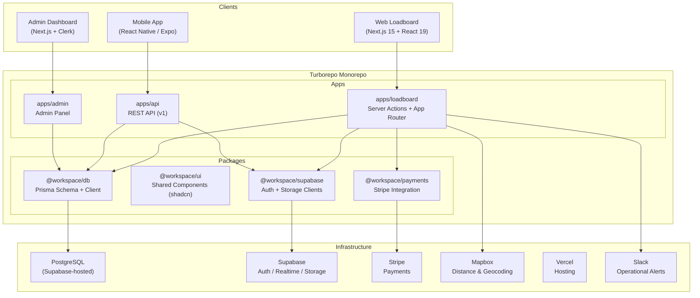
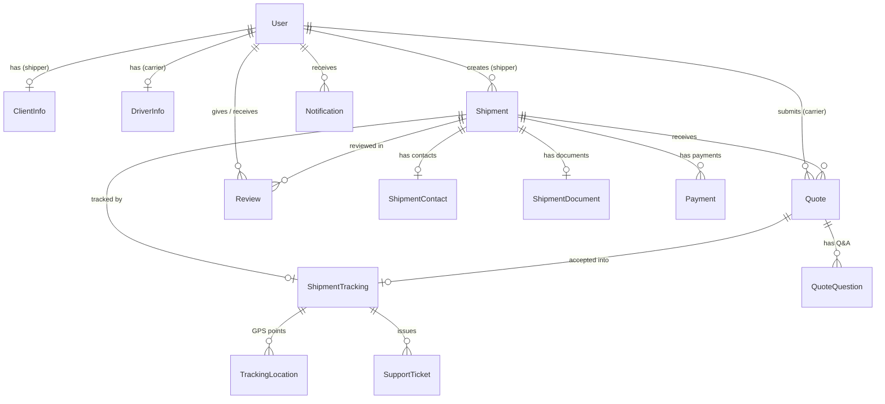
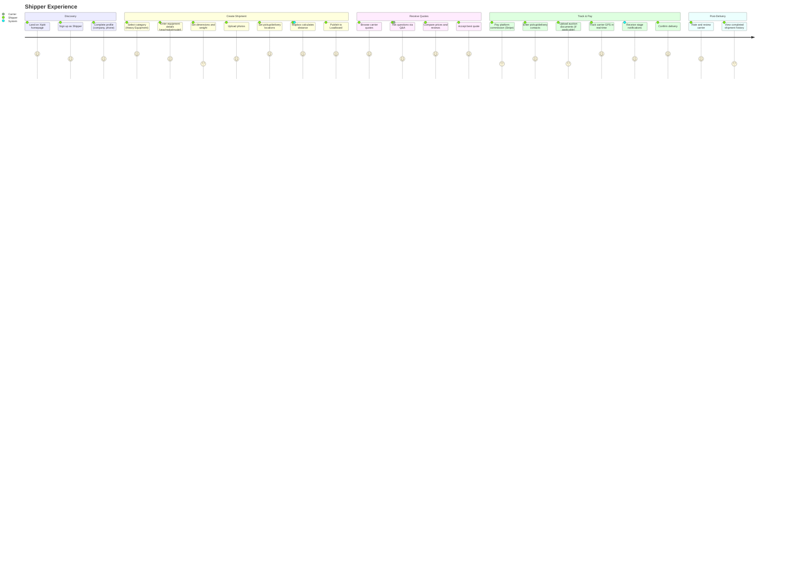
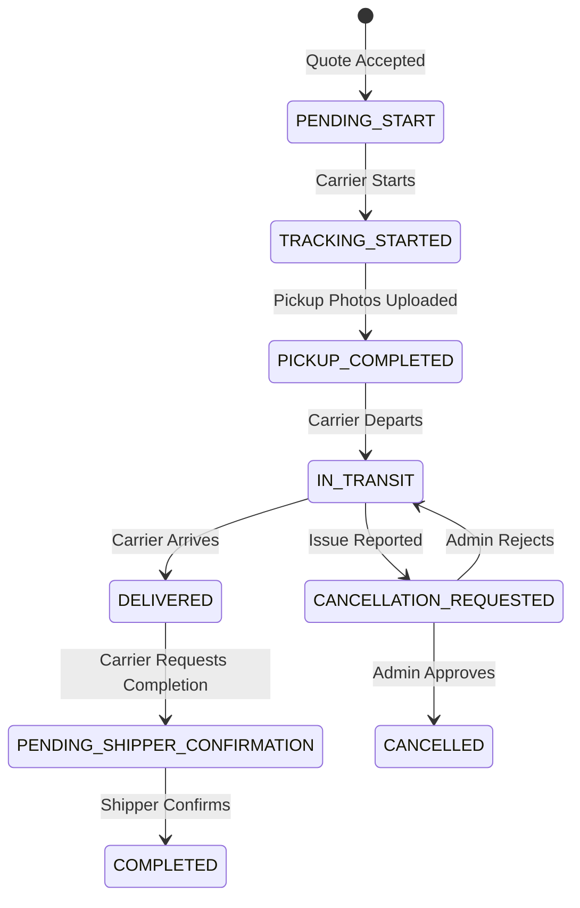

# Xipitt — Technical Product Case Study

> **Heavy Equipment Logistics Marketplace**
> Connecting shippers with specialized carriers across the United States

---

## Table of Contents

1. [Executive Summary](#executive-summary)
2. [Problem Statement](#problem-statement)
3. [Functional Requirements](#functional-requirements)
4. [Non-Functional Requirements](#non-functional-requirements)
5. [Technical Architecture](#technical-architecture)
6. [Technical Challenges](#technical-challenges)
7. [Engineering Decisions](#engineering-decisions)
8. [User Journey](#user-journey)
9. [Impact & Lessons Learned](#impact--lessons-learned)

---

## Executive Summary

**Xipitt** is a full-stack logistics marketplace platform designed to connect shippers with verified carriers for the transportation of heavy equipment, vehicles, boats, and freight across the United States. The platform operates as a **loadboard-style marketplace** where shippers post shipments, carriers submit competitive quotes, and the system orchestrates the entire lifecycle — from quoting and payment to real-time GPS tracking and delivery confirmation.

The system was architected as a **Turborepo monorepo** comprising four applications — a web loadboard (Next.js 15), a REST API service for mobile clients (Next.js API Routes), a React Native mobile app (Expo), and an administrative dashboard — all sharing a unified PostgreSQL database through Prisma ORM, with Supabase providing authentication, real-time capabilities, and file storage.

| Dimension | Detail |
|---|---|
| **Platform** | Web (Next.js 15 + React 19), Mobile (React Native / Expo), Admin Dashboard |
| **Backend** | PostgreSQL, Prisma ORM, Supabase Auth & Realtime, Stripe Payments |
| **Infra** | Vercel (Web + API), Supabase (BaaS), Turborepo Monorepo |
| **Target Market** | Heavy equipment shippers & carriers in the United States |
| **Business Model** | Configurable commission-based (default 20%) on each transaction |

---

## Problem Statement

The heavy equipment transportation industry in the United States faces several systemic inefficiencies:

### Market Pain Points

1. **Fragmented Discovery** — Shippers rely on phone calls, word-of-mouth, or outdated broker networks to find carriers certified for oversized or heavy loads. There is no centralized digital marketplace for heavy equipment transport.

2. **Lack of Transparency** — Pricing is opaque, with shippers having limited visibility into competitive rates. There is no standardized quoting mechanism that allows carriers to bid openly.

3. **No Real-Time Visibility** — Once equipment is handed over to a carrier, shippers have no digital means to track their high-value assets in transit. Communication happens via sporadic phone calls and text messages.

4. **Trust Deficit** — Shippers are entrusting multi-hundred-thousand-dollar equipment to unknown carriers without a reliable verification system, review history, or payment protection.

5. **Manual Coordination Overhead** — The pickup-to-delivery lifecycle (contact exchange, document handling, payment processing, delivery confirmation) is largely manual, error-prone, and time-consuming.

### Target Users

| Persona | Description |
|---|---|
| **Shipper (Individual)** | Equipment owners, auction buyers, construction companies that need to transport heavy machinery between job sites, auctions, or dealerships. |
| **Shipper (Business)** | Fleet managers, rental companies, and dealers handling high-volume transport requests. |
| **Carrier / Driver** | Owner-operators and small fleets with flatbed, lowboy, or RGN trailers specialized in heavy haul transport. |

### Opportunity

Build a purpose-built digital marketplace that brings the convenience of consumer logistics platforms (like Uber Freight) to the niche but high-value heavy equipment transportation segment — complete with verified carriers, competitive quoting, integrated payments, and real-time tracking.

---

## Functional Requirements

### FR1 — Dual-Role User System

- Users register as either **SHIPPER** or **CARRIER** with role-specific onboarding flows.
- Shippers provide company details, phone, and address (`ClientInfo`).
- Carriers provide MC Number, license, vehicle plate, and complete a multi-step document verification (8 documents including license photos, truck plates, MC/DOT visible, trailer photo, and carrier package PDF).
- Admin verification workflow gates carrier access to quoting.

### FR2 — Shipment Management

- Multi-category support: **Vehicles/Trucks**, **Heavy Equipment**, **Boats**, **Freight**, and **Other**.
- Rich shipment details: year/make/model, dimensions (L×W×H), weight, handling unit type, freight properties (hazardous, stackable, operable, etc.).
- Dual unit system support (English/Metric).
- Image uploads via Supabase Storage with signed URLs.
- Lifecycle tags: `DRAFT` → `QUOTE` → `LOADBOARD`.
- Advanced pickup/delivery with date ranges, geolocation (lat/long), and Mapbox-powered distance calculation.

### FR3 — Loadboard & Quoting Engine

- Live loadboard showing `LIVE` shipments available for carriers to browse and quote.
- Carriers submit quotes with a **carrier amount**; the system automatically calculates the shipper-facing **total amount** by applying a configurable commission (stored in `PlatformConfig`).
- Quote statuses: `PENDING` → `ACCEPTED` / `REJECTED` / `EXPIRED` / `NO_ACCEPTED`.
- In-quote Q&A system (`QuoteQuestion`) allowing shippers and carriers to exchange questions/answers with read receipt tracking.
- Quote validity management with expiration dates.

### FR4 — Multi-Stage Tracking System

- Upon quote acceptance, a `ShipmentTracking` record is created orchestrating the full delivery lifecycle:

```
PENDING_START → TRACKING_STARTED → PICKUP_COMPLETED → IN_TRANSIT → DELIVERED
→ PENDING_SHIPPER_CONFIRMATION → COMPLETED
```

- Photo evidence at each stage (pickup, in-transit, delivery images stored in Supabase).
- Bilateral completion confirmation: carrier requests completion, shipper confirms delivery.
- Cancellation flow with reason, admin review, and optional penalty.
- **Real-time GPS tracking** via `TrackingLocation` model recording carrier latitude/longitude, speed, heading, altitude, and accuracy.

### FR5 — Payment Processing (Stripe)

- Commission-based payment model: platform charges a configurable commission (default 20%) on each transaction.
- `Payment` model tracking Stripe PaymentIntents with statuses: `PENDING`, `SUCCEEDED`, `FAILED`, `CANCELED`, `REFUNDED`.
- Transaction lifecycle states: `PENDING_COMMISSION` → `COMMISSION_PAID` → `CARRIER_PAID` → `FULL_PAYMENT_COMPLETED`.
- Secure payment via Stripe with customer IDs, payment methods, and save-for-later functionality.

### FR6 — Review & Rating System

- Bidirectional reviews: shippers rate carriers and vice versa.
- 1–5 star rating with optional comment, locked to one review per user per shipment.
- Review history surfaces on carrier profiles for trust building.

### FR7 — Notification System

- Multi-channel: **In-App**, **Email**, **Push** (mobile via Expo Push Tokens).
- Event-driven notifications for: quote created/accepted/rejected, tracking status changes, payment events, shipment lifecycle events.
- User-configurable preferences per event type and channel.
- Priority levels: LOW, NORMAL, HIGH, URGENT.
- Email templates with HTML and plaintext fallbacks.

### FR8 — Support Ticket System

- Ticket types: General Support, Shipment Issue, Tracking Issue, Payment Issue, Account Issue, Technical Issue.
- Priority-based queue (LOW → URGENT) with statuses: `OPEN` → `IN_PROGRESS` → `WAITING_USER` → `RESOLVED` → `CLOSED`.
- Contextual linking to related shipments and tracking records.
- Admin notes and resolution documentation.

### FR9 — Document & Contact Management

- `ShipmentContact` model for detailed pickup/delivery contact information (name, phone, full address, special notes, signature requirement).
- `ShipmentDocument` for auction-specific documents: Item Release PDF upload, buyer name, lot number, serial number (VIN), auction name, and release codes.

---

## Non-Functional Requirements

### NFR1 — Performance

| Metric | Target |
|---|---|
| Page Load (LCP) | < 2.5s with Turbopack + React 19 optimizations |
| API Response Time | < 200ms (p95) for critical paths |
| Real-time Latency | < 500ms for GPS tracking updates and chat |
| Image Optimization | Client-side compression before upload (`image-compression.ts`) |

### NFR2 — Security

- **Authentication**: Supabase Auth with JWT tokens for main apps; Clerk for admin dashboard (separate auth domain).
- **Authorization**: Row Level Security (RLS) on Supabase Storage; role-based access control at the application layer.
- **Data Isolation**: Carriers can only access their own verification documents (`private/{userId}/` storage paths).
- **File Validation**: Strict type checking (JPEG, PNG, WebP, PDF only) and 50MB size limits.
- **Payment Security**: Stripe PCI-compliant payment processing with tokenized card storage.

### NFR3 — Scalability

- Monorepo architecture enables independent deployment of web, API, and admin services.
- Database indexing strategy with composite indexes on high-query patterns (e.g., `[userId, tag]`, `[category, loadboardStatus]`, `[pickupZipCode, deliveryZipCode]`).
- Prisma binary targets for `native`, `rhel-openssl-3.0.x`, and `debian-openssl-3.0.x` to support multi-platform deployments.

### NFR4 — Reliability

- API rate limiting: 100 requests/minute in production.
- Graceful Decimal serialization handling across API boundaries (avoiding `Do not know how to serialize a Decimal` errors).
- Support ticket system as a safety net for edge-case failures.

### NFR5 — Maintainability

- Shared packages (`@workspace/db`, `@workspace/ui`, `@workspace/supabase`) ensure single source of truth.
- Vitest testing on loadboard, Jest on chat package (80% coverage threshold).
- TypeScript 5.7 strict mode across all packages.
- ESLint + Prettier enforced formatting.

---

## Technical Architecture

### High-Level System Overview



### Data Model Architecture



### API Architecture (Mobile-Facing)

The `apps/api` service exposes a versioned REST API (`/v1`) with two main route groups:

| Route Group | Purpose | Key Endpoints |
|---|---|---|
| `/v1/driver/*` | Carrier-facing endpoints | `explore`, `profile`, `quotes`, `tracking`, `verification`, `shipment`, `rating`, `questions`, `register` |
| `/v1/mobile/*` | Shipper-facing (mobile) endpoints | `auth`, `shipments`, `quotes`, `profile`, `mapbox`, `calculate-distance`, `savings`, `shipment-tracking` |

All endpoints are authenticated via **Supabase JWT tokens** — the `userId` is extracted from the JWT payload server-side, never sent by the client.

### Technology Stack Summary

| Layer | Technology | Rationale |
|---|---|---|
| **Web Framework** | Next.js 15.2 (App Router + Turbopack) | Server Components, Server Actions, Streaming, optimal performance |
| **UI Library** | React 19 | Concurrent rendering, `use` API, improved Suspense |
| **Styling** | Tailwind CSS + NativeWind | Cross-platform styling between web and mobile |
| **Components** | shadcn/ui (shared `@workspace/ui`) | Accessible, unstyled primitives with full design control |
| **Database** | PostgreSQL + Prisma ORM | Type-safe queries, migrations, schema-as-code |
| **Auth** | Supabase Auth (main), Clerk (admin) | Session management, JWT tokens, social auth |
| **Realtime** | Supabase Realtime | WebSocket subscriptions for live updates |
| **Payments** | Stripe | PCI-compliant card processing, PaymentIntents |
| **Maps** | Mapbox | Route distance calculation, geocoding |
| **Storage** | Supabase Storage | Document uploads, signed URLs,RLS-protected buckets |
| **Mobile** | React Native + Expo 53 | Cross-platform iOS/Android with OTA updates |
| **Monorepo** | Turborepo + pnpm workspaces | Parallel builds, dependency caching, shared packages |
| **Testing** | Vitest (web) + Jest (chat, 80% coverage) | Fast unit/integration testing |
| **Deployment** | Vercel | Edge-optimized, preview deployments, CI/CD |
| **Alerts** | Slack Integration | Operational notifications for critical events |

---

## Technical Challenges

### Challenge 1 — Dual-Role Architecture with Shared Identity

**Problem:** Users are either shippers or carriers, but they share a single `User` model. Each role requires entirely different UI flows, data models (`ClientInfo` vs `DriverInfo`), dashboards, and permissions — while maintaining a unified authentication layer.

**Solution:** Implemented a polymorphic user model with optional one-to-one relations (`ClientInfo` and `DriverInfo`). The `UserRole` enum gates access at both the middleware and component level. The loadboard app uses parallel route groups (`/loadboard/shipper/*` and `/loadboard/carrier/*`) with role-based layout components and sidebar navigation that dynamically adapts based on the user's role.

### Challenge 2 — Commission Calculation Across Boundaries

**Problem:** The platform takes a configurable commission on each quote. The carrier inputs their desired price, but the shipper sees a different (higher) total. These values flow through the entire pipeline — from quote creation, to acceptance, into `ShipmentTracking`, through `Payment` records, and back into financial reporting.

**Solution:** Introduced a clear separation of monetary fields:
- `carrierAmount` — What the carrier earns
- `commissionRate` / `commissionAmount` — Platform's cut
- `totalAmount` — What the shipper pays

The `PlatformConfig` model stores the commission rate as a configurable key-value pair, allowing runtime changes without redeployment. All `Decimal` fields use `@db.Decimal(10, 2)` precision and require careful serialization (`.toString()`) when crossing API boundaries to avoid JSON serialization errors.

### Challenge 3 — Multi-Stage Tracking State Machine

**Problem:** Shipment tracking involves 9+ distinct states with complex transition rules, bilateral confirmation requirements, cancellation workflows with admin review, and parallel concerns (payment status, photo evidence, GPS location).

**Solution:** Modeled tracking as a comprehensive state machine within `ShipmentTracking`, with each stage recording its timestamp (`trackingStartedAt`, `pickupCompletedAt`, `inTransitStartedAt`, etc.). The bilateral completion pattern requires both `carrierCompletionRequestedAt` and `shipperConfirmedDeliveryAt` before the system transitions to `COMPLETED`. Cancellation requests enter an `UNDER_REVIEW` state requiring admin approval, with optional financial penalties tracked via `cancellationPenalty`.

### Challenge 4 — Real-Time GPS Tracking at Scale

**Problem:** Carriers transmitting GPS positions continuously during transit generates high write volume. Shippers need to see live positions with minimal latency. The system must handle concurrent active shipments without overwhelming the database.

**Solution:** The `TrackingLocation` model stores GPS data points (latitude, longitude, accuracy, speed, heading, altitude) with optimized composite indexes (`[trackingId, recordedAt DESC]`). The `useRealtimeLocation` hook on the frontend subscribes to Supabase Realtime channels for push-based updates, while `useThrottle` prevents excessive re-renders. DB-generated UUIDs (`gen_random_uuid()`) offload ID generation to PostgreSQL for better write throughput.

### Challenge 5 — Cross-Platform Data Consistency

**Problem:** The same business logic (shipment details, quote calculations, tracking updates) must behave identically across web (Next.js Server Actions), mobile API (REST endpoints), and admin dashboard — all consuming a shared database.

**Solution:** The monorepo architecture with `@workspace/db` as a shared Prisma client ensures a single source of truth for all data access. Shared packages (`@workspace/ui`, `@workspace/supabase`) eliminate code duplication. The API serialization layer carefully handles Prisma's `Decimal` type, optional fields, and nested relation queries to produce consistent JSON responses across all surfaces.

---

## Engineering Decisions

### Decision 1 — Turborepo Monorepo over Polyrepo

**Context:** The platform has 4 applications (web, API, mobile, admin) and 6 shared packages.

**Decision:** Adopted a Turborepo monorepo with pnpm workspaces.

**Rationale:**
- **Shared Prisma schema:** All apps consume the same database models without version drift
- **Component reuse:** `@workspace/ui` provides consistent UI across web and admin
- **Atomic changes:** A database migration, API update, and frontend change can ship as a single commit
- **Build caching:** Turborepo's remote caching prevents redundant builds across CI runs

**Trade-off:** Increased initial setup complexity and steeper learning curve for new contributors.

### Decision 2 — Supabase as BaaS over Custom Backend

**Context:** Needed authentication, real-time subscriptions, object storage, and PostgreSQL hosting.

**Decision:** Adopted Supabase as the primary backend-as-a-service layer.

**Rationale:**
- **All-in-one:** Auth, Realtime, Storage, and PostgreSQL under a single provider
- **RLS:** Row Level Security enables fine-grained access control at the database level (used for carrier document storage isolation)
- **Realtime channels:** WebSocket-based pub/sub for live tracking, quote notifications, and typing indicators without maintaining custom WebSocket infrastructure
- **JWT integration:** Seamless token-based auth that works identically across web and mobile

**Trade-off:** Vendor lock-in on Supabase-specific features (Realtime channels, Storage RLS policies). Mitigated by abstracting Supabase behind `@workspace/supabase` package interfaces.

### Decision 3 — Next.js Server Actions for Web, REST API for Mobile

**Context:** Web users interact via a full Next.js app with server components, while mobile users need a traditional REST API.

**Decision:** Used Server Actions (`actions/` directory with 65+ files) for the web loadboard, and a separate `apps/api` with versioned REST routes for mobile.

**Rationale:**
- **Web:** Server Actions co-locate business logic with UI, reduce client-side JavaScript, and leverage React 19's form action capabilities
- **Mobile:** React Native cannot consume Server Actions directly; a versioned REST API (`/v1/`) provides a stable contract with proper JSON serialization
- **Shared DB:** Both consume `@workspace/db`, ensuring data consistency despite different transport layers

### Decision 4 — Separate Admin Auth (Clerk) vs Main Auth (Supabase)

**Context:** The admin dashboard has different security requirements than the user-facing apps.

**Decision:** Used Clerk for admin authentication, Supabase for main platform auth.

**Rationale:**
- **Separation of concerns:** Admin users are a completely different user pool with different security policies
- **Enhanced admin security:** Clerk provides MFA, session management, and role-based access tailored for internal tools
- **No cross-contamination:** A compromised user token cannot grant admin access and vice versa

### Decision 5 — Configurable Commission via `PlatformConfig`

**Context:** The business model requires a commission on each transaction, but the rate may change over time.

**Decision:** Stored the commission rate in a `PlatformConfig` key-value table rather than hardcoding.

**Rationale:**
- **Runtime flexibility:** Commission rate can be adjusted without code deployment
- **Audit trail:** `lastModifiedBy` and timestamps track who changed the rate and when
- **Extensibility:** The same pattern supports future platform-wide settings (e.g., default quote validity days, minimum quote amounts)

---

## User Journey

### Shipper Journey



### Carrier Journey


### Tracking State Machine



---

## Impact & Lessons Learned

### Impact

| Metric | Outcome |
|---|---|
| **Platform Scope** | End-to-end marketplace covering discovery, quoting, payment, tracking, and post-delivery reviews |
| **Data Model Complexity** | 20+ Prisma models with 870 lines of schema, handling complex financial flows and multi-stage workflows |
| **API Surface** | 17+ REST endpoints (versioned) for mobile + 65+ Server Actions for web |
| **Component Library** | 197+ components with cross-app sharing via `@workspace/ui` |
| **Cross-Platform** | Single codebase serving web (Next.js 15), mobile (Expo/React Native), and admin (Clerk-gated) |
| **Real-Time Features** | GPS tracking, quote notifications, typing indicators, and live loadboard updates |

### Lesson 1 — Schema Design is Product Design

The Prisma schema became the single most important artifact in the project. Every product decision — from the commission model (`carrierAmount` vs `totalAmount`) to the tracking state machine (9 states with bilateral confirmation) — was directly reflected in the schema. Investing in careful schema design upfront prevented costly migrations later and kept all four applications aligned.

### Lesson 2 — Serialize Early, Serialize Often

Prisma's `Decimal` type causes serialization failures when passed directly to JSON responses. This manifested as cryptic runtime errors across the API layer. The lesson: always transform database types at the boundary layer, and centralize serialization logic (e.g., `.toString() ?? null` patterns) to prevent per-endpoint bugs.

### Lesson 3 — Monorepo Pays Off at Scale

The initial cost of configuring Turborepo, shared packages, and cross-app TypeScript paths was significant. However, beyond 3+ applications sharing a database and UI library, the monorepo approach eliminated entire categories of bugs — schema drift, component inconsistency, and version mismatches across packages. The ability to make an atomic change across schema → API → frontend was transformational for velocity.

### Lesson 4 — Dual Auth is Worth the Complexity

Running Supabase Auth for users and Clerk for admins initially seemed over-engineered. In practice, it provided critical security isolation — admin sessions, user sessions, and API tokens exist in completely separate domains with different rotation policies, MFA requirements, and compromise blast radii.

### Lesson 5 — State Machines Need Explicit Timestamp Fields

Rather than relying on a single `status` enum and a `updatedAt` timestamp, the tracking model records the exact moment each state was entered (`trackingStartedAt`, `pickupCompletedAt`, `inTransitStartedAt`, etc.). This granularity proved essential for SLA tracking, dispute resolution, and operational analytics — data that would have been lost with a simple status+timestamp approach.

### Lesson 6 — Configurable Business Logic from Day One

Hardcoding the commission rate would have been faster initially, but the `PlatformConfig` pattern allowed the business team to experiment with different commission structures without engineering involvement. This pattern has since been extended to other operational parameters with minimal additional effort.

---

## Technical Summary

Xipitt demonstrates the design and implementation of a domain-specific logistics marketplace handling complex, multi-party workflows in a regulated industry. The architecture balances developer experience (monorepo, shared packages, TypeScript end-to-end) with operational rigor (dual auth domains, configurable business rules, multi-stage state machines with full audit trails). The platform covers the full product lifecycle from MVP to production-grade system — shipment creation, competitive quoting with commission modeling, Stripe-powered payments, GPS-tracked delivery, bilateral confirmation, and post-delivery review systems.

---

<p align="center">
  <strong>Bryan Paredes</strong> · Full-Stack Engineer<br/>
  <em>Built with Next.js 15, React 19, PostgreSQL, Prisma, Supabase, Stripe, and Mapbox</em>
</p>
